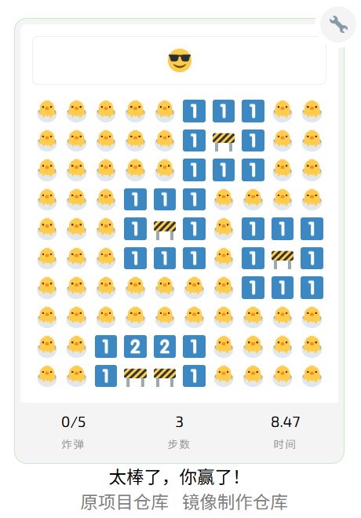

# emoji-minesweeper 表情扫雷游戏 [](https://github.com/feross/standard)


## 部署说明

首先感谢原作者的开源。
- 原项目地址
  - 官网 https://muan.co/emoji-minesweeper/
  - GitHub仓库 https://github.com/muan/emoji-minesweeper
- 我汉化和构建docker镜像的仓库
  - GitHub仓库 https://github.com/Firfr/emoji-minesweeper
  - Gitee仓库 https://gitee.com/firfe/emoji-minesweeper

具体汉化了那些内容，请参考[翻译说明](./翻译说明.md)。


有需要帮忙部署这个项目的朋友,一杯奶茶,即可程远程帮你部署，需要可联系。  
微信号 `E-0_0-`  
闲鱼搜索用户 `明月人间`  
或者邮箱 `firfe163@163.com`  
如果这个项目有帮到你。欢迎start。

有其他的项目的汉化需求，欢迎提issue。或其他方式联系通知。

### 镜像

从阿里云或华为云镜像仓库拉取镜像，注意填写镜像标签，镜像仓库中没有`latest`标签

容器内部端口 3000
- AMD64镜像
  ```bash
  swr.cn-north-4.myhuaweicloud.com/firfe/emoji-minesweeper:2025.05.09
  ```
- ARM64镜像
  ```bash
  swr.cn-north-4.myhuaweicloud.com/firfe/emoji-minesweeper:2025.05.09-arm64
  ```

### docker run 命令部署

```bash
docker run -d \
--name emoji-minesweeper \
--network bridge \
--restart always \
--log-opt max-size=1m \
--log-opt max-file=3 \
-p 3000:3000 \
swr.cn-north-4.myhuaweicloud.com/firfe/emoji-minesweeper:2025.05.09
```
### compose 文件部署 👍推荐

```yaml
#version: '3.9'
services:
  emoji-minesweeper:
    container_name: emoji-minesweeper
    image: swr.cn-north-4.myhuaweicloud.com/firfe/emoji-minesweeper:2025.05.09
    network_mode: bridge
    restart: always
    logging:
      options:
        max-size: 1m
        max-file: '3'
    ports:
      - 3000:3000
```

## 修改说明

这里对除了汉化之外的代码修改的说明。  
增加修改部分具体见 [修改说明](./修改说明.md)。

`./README.md` 文件翻译，增加 `## 部署说明`、`## 修改说明`、`## 效果截图` 部分。

增加目录 `./图片` `./remote_files`(引用的远程文件)
新增文件 `./.dockerignore`、`./Dockerfile`、`./翻译说明.md`、`./修改说明.md`

## 效果截图




## How to play 如何玩

- Left click to step on a spot  
  左键点击：踩中一个格子
- Right click to mark a spot as a bomb  
  右键点击：将一个格子标记为炸弹
- Double click to open all 8 spots nearby a target (except ones already marked as bombs using right clicks)  
  双击：自动打开目标格子周围的所有 8 个格子（除了已经被右键标记为炸弹的格子）

**This is a work in progress**

表情扫雷游戏演示


## API

```javascript
// to start a new game 开始一局新游戏
new Game(cols, rows, bombs, [emptyemoji, bombemoji, flagemoji, starteremoji], twemojiOrNot)

// for example 示例 :
new Game(10, 10, 10, ["🌱", "💥", "🚩", "◻️"], true)
new Game(16, 16, 30, ["🐱", "📛", "💣", "🔍"], false)
```

## Todos 待办事项

- Mobile! 支持移动端！

## Zap ⚡

❤️ https://github.com/twitter/twemoji

## Why 为什么

[WHY IS THIS A QUESTION?! 这个问题本身有问题吗？！](https://twitter.com/muanchiou/status/601633821012856832)
